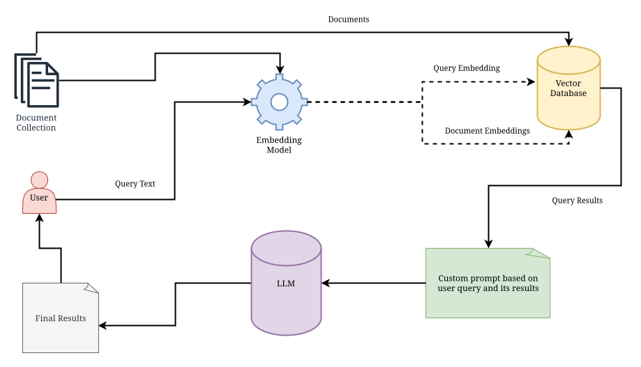

# A Playground for Everything Related to Retrieval Augmented Generation (RAG)

This repository is a playground for everything related to [retrieval augmented generation (RAG)](https://aws.amazon.com/what-is/retrieval-augmented-generation/). It contains scripts, 
notebooks, and other resources to experiment with RAG-related tasks, such as question answering, text generation, and semantic search.

  

## Prerequisites

Before you can use this template, make sure you have Python installed on your system. We are going to
use [Poetry](https://python-poetry.org/) for dependency management. You can install Poetry by running the following command:

`pip install poetry`

To initiate the Poetry environment and install the dependency packages, run the following commands in the shell in the
root folder of this repository after downloading it.

`poetry update && poetry init`

After that, enter the Poetry environment by invoking the poetry's shell using the following command:

`poetry shell`

## Structure

The repository has the following structure:

- `bin/`: scripts and executables for command line use
- `data/`: data files and datasets
- `src/`: source code files
- `notebooks/`: Jupyter notebooks files
- `tests/`: test files for the source code
- `pyproject.toml`: project metadata and dependencies
- `LICENSE`: license information
- `README.md`: project information and instructions

## License

Files in this repository are licensed under the MIT License - see the [LICENSE](LICENSE) file for details.
